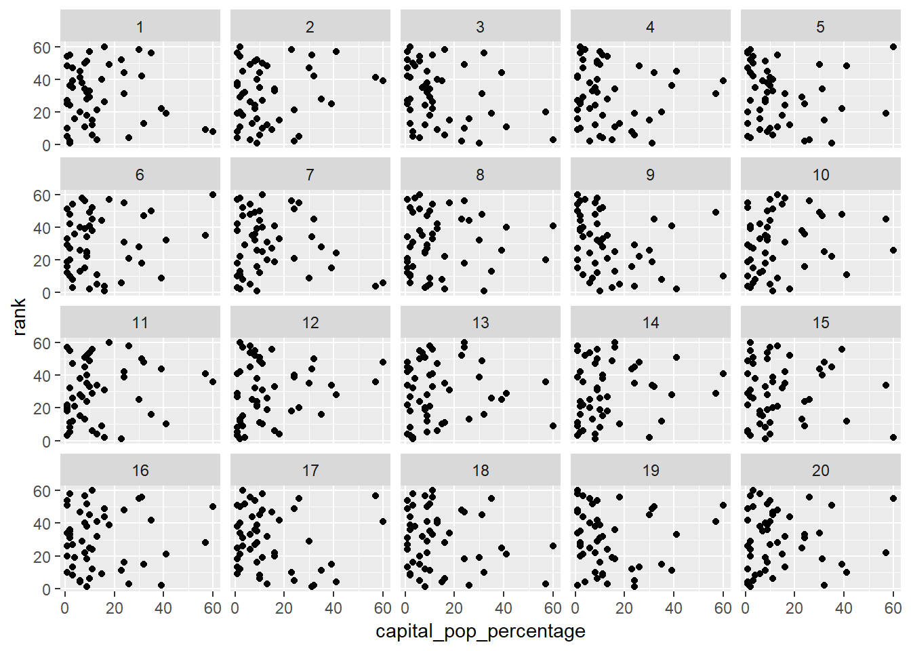
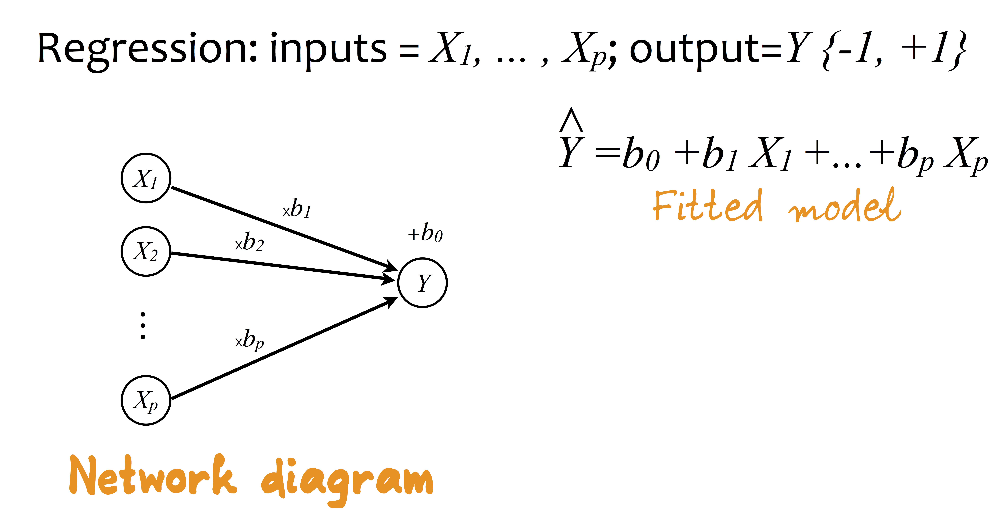
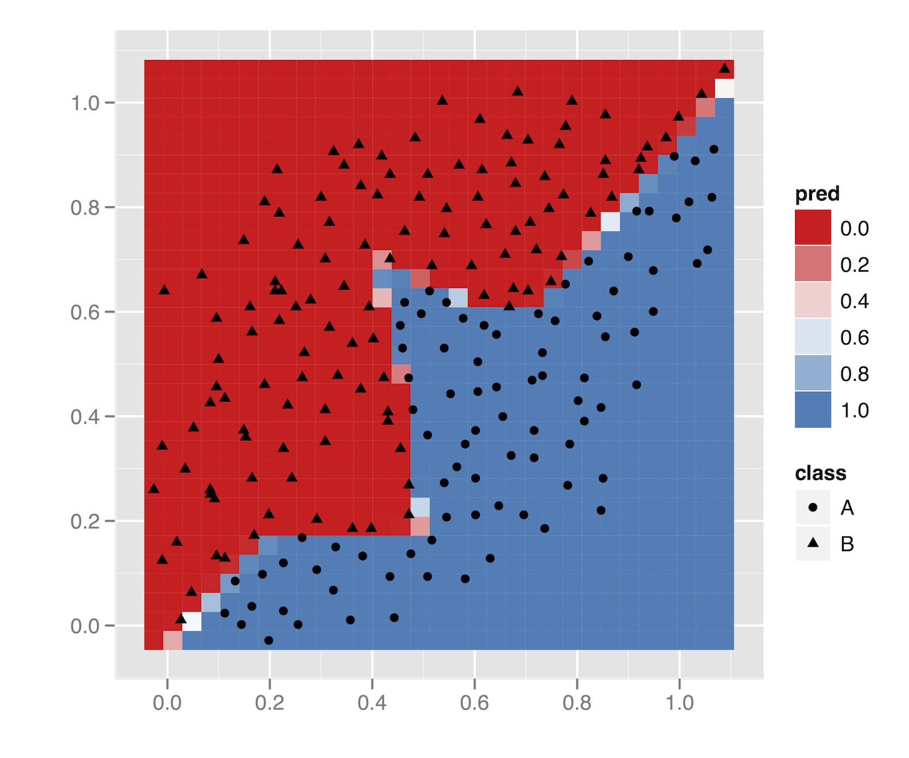
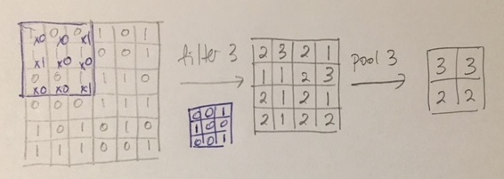
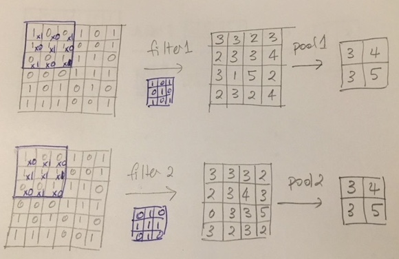
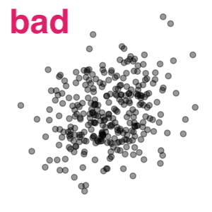
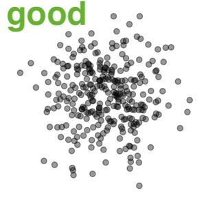
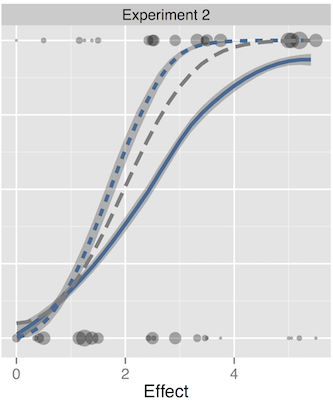
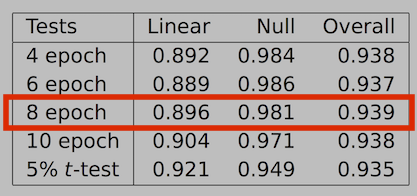
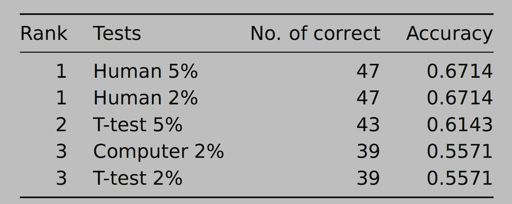

```{r initial, echo = FALSE, cache = FALSE, warning = FALSE, message = FALSE, error=FALSE, results = 'hide'}
library(knitr)
options(htmltools.dir.version = FALSE, tibble.width = 60)
opts_chunk$set(
  message = FALSE, 
  warning = FALSE, 
  error = FALSE, 
  echo = FALSE,
  fig.retina = 3
)
library(tidyverse)
library(kableExtra)
```

```{r xaringan-themer, include=FALSE}
library(xaringanthemer)
solarized_light(
  text_font_family = list(google_font("Lato")),
)
library(tidyverse)
```

class: inverse middle
background-image: url(images/redgum.jpg)
background-position: 110% 50%
background-size: 50%

# Human vs computer

## .pink[*In Visualising Data, Who Wins?*]
## Experiments with building computer vision models for reading residual plots

### .lightgreen[Professor Di Cook <br> Monash University]

.green[DSSV '19, Kyoto <br>Aug 14, 2019]


---
class: inverse middle

`r anicon::faa("hand-paper", size=2, speed ="slow", color="#FD4D6A", anitype="hover")` `r anicon::nia("Hands up if you have fitted a model in the last week", size=2, speed ="slow", color="#959B4C", anitype="hover")`

--

<br>
<br>
<br>

`r anicon::nia("Keep your hand up if you also looked at a residual plot from that model fit", size=2, speed ="slow", color="#D8BA69", anitype="hover")`
--

---
background-image: url(images/cartoon.png)
background-size: contain

---

background-image: url(images/housekeeping.png)
background-size: contain

---

background-image: url(images/robot.png)
background-size: contain

---

# Outline

- Motivation: inspiration for these experiments
- Methods
    - Deep learning: image recognition
    - Visual inference: process and framework
- Experiments
    - Design
    - Results
- Future
- Acknowledgements, resources and references

```{r eval=FALSE}
df <- tibble(fitted = runif(500), resid = rnorm(500))
ggplot(df, aes(x=fitted, y=resid)) + 
  geom_point() +
  xlab("Fitted values") +
  ylab("Residuals")
```

---
background-image: url(images/simchoni.png)
background-size: 80%

# True motivation is Giora's blog post


---
.left-code[
Trained a computer vision two ways:

- classification, significant correlation vs not
- regression, to predict the correlation

.green[Success, picked plot 16]
]
.right-plot[

]
---
.left-code[
Trained a computer vision two ways:

- classification, significant correlation vs not
- regression, to predict the correlation

.green[Success, failed to pick plot 4]
]
.right-plot[

]
---
.left-code[
Trained a computer vision two ways:

- classification, significant correlation vs not
- regression, to predict the correlation

.pink[Fail! Doesn't see the strong nonlinear association. Picks the most linear.]
]
.right-plot[

]

---
.left-column[
# Deep learning
]
.right-column[


.footnote[Source: [Abdellatif Abdelfattah](https://medium.com/@tifa2up/image-classification-using-deep-neural-networks-a-beginner-friendly-approach-using-tensorflow-94b0a090ccd4)]
]
---

.left-column[
# Deep learning
]
.right-column[


.footnote[Source: [Chihuahua or Muffin? Brad Folkens](https://blog.cloudsight.ai/chihuahua-or-muffin-1bdf02ec1680)]
]

---
.left-column[
# Deep learning

### Neural network
]
.right-column[
A linear model can be thought of as a neural network:



.footnote[Source: [Cheng and Titterington (1994)](https://projecteuclid.org/euclid.ss/1177010638)]
]

---
.left-column[
# Deep learning

### Neural network
]
.right-column[
A simple neural network, contains a hidden layer, to increase/decrease dimensionality, and a transformation through a (logistic) function:


]

---
.left-column[
# Deep learning

### Neural network
]
.right-column[




.footnote[Example from [Wickham et al (2015) "Removing the blindfold"](https://onlinelibrary.wiley.com/doi/abs/10.1002/sam.11271)]

]
---

.left-column[
# Fitting neural networks is difficult


.footnote[Example from [Wickham et al (2015) "Removing the blindfold"](https://onlinelibrary.wiley.com/doi/abs/10.1002/sam.11271)]

]
.right-plot[


]

---
.left-column[
# Deep learning

### Neural network
### Convolutional NN
]
.right-plot[

Thinking about images as data, requires unpacking into variables:


]

---
.left-column[
# Deep learning

### Neural network
### Convolutional NN
]
.right-column[

- Proximity in an image matters though. 
- The dimension reduction takes into account of neighbouring cells in the image, using filters



]

---
.left-column[
# Deep learning

### Neural network
### Convolutional NN
]
.right-column[

Applying multiple filters



]

---
.left-column[
# Deep learning

### Neural network
### Convolutional NN
### Software
]
.right-column[

The [keras](https://keras.rstudio.com) package in R, interfaces to python software, provides a convenient way to fit the convolutional neural network. 


]

---
class: center
background-image: url(images/robot.png)
background-size: 100%

## Training the robot

---
# Model set up overview

- Formulate the problem as a classification task: "good" vs "bad" residual plot
- Simulate an enormous number of both types of residual plots
- Train the model on half of these
- Choose the best model by accuracy with the other half

 

.footnote[beta=0.7, sigma=12, n=300]
---

background-image: url(images/training.png)
background-size: 100%

.footnote[Source: Shuofan Zhang]

---
# Model training

1. Simulate data (X, Y) from the null and the alternative models.

2. Generate scatterplots of X and Y

3. Save scatter plots as 150 × 150 pixels images

4. Train a deep learning classifier to recognise the patterns from two groups

5. Test the model's performance on new data and compute the accuracy

6. One model chosen as the best, to compare performance with humans

---
class: center middle
background-image: url(images/housekeeping.png)
background-size: 150%

## How the human evaluated residuals plots

---
.left-column[
# Human evaluation
### Lineup protocol
]
.right-column[
- Statistical inference with graphics, follows classical hypothesis testing procedures
- Lineup protocol embeds the data plot among a field of null plots (comparison of test statistic with sampling distribution)
- Human observers pick plot that is most different from the others
- $p$-value calculated from the probability that the data plot is selected by chance

[Buja et al (2009)](http://rsta.royalsocietypublishing.org/content/367/1906/4361) ideas, [Majumder et al (2013)](https://www.tandfonline.com/doi/abs/10.1080/01621459.2013.808157) validation

]

---

background-image: url(images/inference_diagram.png)
background-size: contain

.footnote[[Majumder et al (2013)](https://www.tandfonline.com/doi/abs/10.1080/01621459.2013.808157)]
---
.left-column[
# Human evaluation
### Lineup protocol
### Database
]
.right-column[

- [Majumder et al (2013)](https://www.tandfonline.com/doi/abs/10.1080/01621459.2013.808157) conducted validation study to compare the performance of the lineup protocol, assessed by human evaluators, in comparison to the classical test
- Experiment 2 examined $H_o: \beta_k = 0 ~~vs ~~H_a: \beta_k \neq 0$
- 70 lineups of size 20 plots: $n=100, 300; \beta \in [-6, 4.5]; \sigma=5, 12$
- 351 evaluations by human subjects
- Amazon's Mechanical Turk used to recruit observers

]

---

.left-column[
# Human evaluation
### Lineup protocol
### Database
### Try it
]
.right-column[
Let's do a couple:

<br>
<br>

*From the field of 20 plots shown, pick the plot with the strongest linear relationship between the two variables.*
]

---

background-image: url(images/plot_turk2_300_150_5_3.png)
background-size: contain

---

.left-column[
# Human evaluation
## Lineup protocol
## Database
## Try it
]
.right-column[
<br>
<br>
<br>
*If you chose 19 you picked the data plot.*

In the Turk study 76/78 observers chose plot 19. The estimated p-value is 0. It is very unlikely to see this result if the data plot was a sample a population with no relationahip between the variables. 


]


---

background-image: url(images/plot_turk2_300_10_5_3.png)
background-size: contain

```{r eval=FALSE}
turk <- read_csv("data/data_turk2.csv")
turk %>% filter(pic_name == "plot_turk2_300_150_5_3.png") %>%
  count(response)
library(nullabor)
pvisual(76, 78)
turk %>% filter(pic_name == "plot_turk2_300_10_5_3.png") %>%
  count(response)
turk %>% filter(pic_name == "plot_turk2_300_10_5_3.png") %>%
  count(response_no)
pval <- read_csv("data/pvalue_turk2.csv")
pval %>% filter(pic_name == "plot_turk2_300_10_5_3.png") 
```

---

.left-column[
# Human evaluation
### Lineup protocol
### Database
### Try it
]
.right-column[
<br>
<br>
<br>
*If you chose 18 you picked the data plot.*

In the Turk study 0/19 observers chose plot 18. The estimated p-value is 1. It is very likely to see this result if the data plot was a sample a population with no relationahip between the variables. 

11/19 chose plot number 19. This plot is the plot in the field that has the smallest p-value. People do tend to pick the plot that has the smallest p-value (or the most structure). 

]

---

.left-column[
# Human evaluation
### Lineup protocol
### Database
### Try it
### Validation

.footnote[Source: [Majumder et al (2013)](https://www.tandfonline.com/doi/abs/10.1080/01621459.2013.808157)]

]
.right-plot[

Effect $= \frac{\sqrt{n}\times |\beta|}{\sigma}$




]
---

background-image: url(images/diaghm.png)
background-size: 100%

.footnote[Source: Shuofan Zhang]

---

.left-column[
# Human vs computer
### Comparison
]
.right-plot[

$H_o: \beta_k = 0 ~~vs ~~H_a: \beta_k \neq 0$

Linear vs no relationship (null)

]

---
.left-column[
# Human vs computer
### Comparison
### Computer model
]
.pull-right[

Simulation 

$$Y_i = \beta_0 + \beta_1 X_{i}  + \varepsilon_i, ~~i=1, \dots , n$$

- $X \sim N[0,\ 1]$
- $\beta_0 = 0$ (intercept)
- $\beta_1\sim U[-10, -0.1] \bigcup [0.1, 10]$  (linear, null when $\beta_1=0$)
- $\varepsilon\sim N(0, \sigma^2) \ where\ \sigma \sim U[1,12]$ 
- $n=U[50,500]$  
- 200,000 from each linear and null scenario generated



]

---
.left-column[
# Human vs computer
### Comparison
### Computer model
### Testing
]
.pull-right[

### Computer model prediction

- Re-generate the 70 *data plots* using the same data in Turk study (without null plots)
- Use the computer model to predict whether the 70 data plots were "linear" or "null"
- The computer model's predicted accuracy over the 70 data plots are recorded as the model's performance.
]

---
.left-column[
# Human vs computer
### Comparison
### Computer model
### Testing
]
.pull-right[

### Human subjects results

- Calculate $p$-value associated with each lineup using the binomial formula (from Majumder), with $N$=number of evaluations and k=number of people choosing data plot
- Draw conclusion: reject the null when the calculated $p$-value is smaller than $\alpha$.
- The accuracy of the conclusions over the 70 lineups 
]
---
class: inverse middle center

`r anicon::faa("hourglass", animate="tada", speed="slow", color="#FD4D6A", size=2)` 

### Stay tuned for the result!
--

## Experiment repeated

---
# Repeat of experiment

Using same sample of $n$, $\beta$, $\sigma$, new data generated, and images created numerically by binning (to 30x30 pixels), counting and scaling counts to 0-255.

Keras model fitted with 60,000 training images for each class, linear and not.

Accuracy with simulated test data, 93%. Null error 0.0179, linear error 0.1176

.footnote[Code available in the file `keras_correlation.r`]
--

.pink[Its blindingly fast!]

---

background-image: url(images/drumroll.gif)
background-size: 100%

---
.left-column[
# Human vs computer
### Comparison
### Computer model
### Testing
### Results
]
.right-plot[

# Results 1



.pink[Humans beat computers.] 

]
---
.left-column[
# Human vs computer
### Comparison
### Computer model
### Testing
### Results
]
.right-plot[

# Results 2


.pink[Humans beat computers, and match the power of the theoretical t-test (uniformly most powerful test).]

]
---
# Comparison of human and computer. 
 
<table>
<tr> <th> </th> <th> </th> <th colspan="2"> Computer </th> </tr>
<tr> <th> </th> <th>  </th> <th> Not </th> <th> Linear </th> </th> </tr>
<tr> <th rowspan="2"> Human </th> <th> Not </th> <td> 27 </td> <td> 0 </td> </tr>
<tr>  <th> Linear </th> <td> 15 </td> <td> 28 </td> </tr>
</table>

<br>
<br>

.pink[Computer tends to predict too many as not linear.]

---
background-image: url(images/simchoni2.png)
background-size: contain

[Giora Simchoni's JSM 2019 talk](http://giorasimchoni.com/deep_visual_inference.html#/1)

---

# Summary

- Computer model trained specifically on detecting linear vs no relationship, comes close but does not beat human evaluation
- Results are consistent: images vs binned data, image size, number of training samples

---
.left-code[
# Discussion

Graphics are important in data analysis

```{r out.width="80%"}
library(datasauRus)
mydsdz <- datasaurus_dozen %>% filter(dataset != "slant_up")
ggplot(mydsdz, aes(x=x, y=y)) + 
  geom_point() +
  facet_wrap(~dataset, ncol=4) + 
  theme(aspect.ratio=1)
```

.footnote[Source: [Matejka, J. and Fitzmaurice, G. (2017)](https://www.autodeskresearch.com/publications/samestats) and [Locke, S. and D'Agostino McGowan, L. (2018)](https://CRAN.R-project.org/package=datasauRus)]
]
.right-plot[

Same numerical statistics but radically different structure

```{r}
mydsdz %>% group_by(dataset) %>%
  summarise(mx=round(mean(x), 1), 
            my=round(mean(y), 1),
            sx=round(sd(x), 1), 
            sy=round(sd(y), 1),
            r = round(cor(x, y), 1)) %>%
  kable() %>% kable_styling()
```

]

---
.left-code[
[Residual (Sur)Realism](https://www4.stat.ncsu.edu/~stefanski/nsf_supported/hidden_images/stat_res_plots.html#Download_Data_Sets) or how to hide images in your residuals.

```{r fig.height=7}
library(sawfish)
fl <- find_files("https://www4.stat.ncsu.edu/~stefanski/nsf_supported/hidden_images/box_quote_files/", "txt")
d <- matrix(scan(paste0(attr(fl, "base"), fl[1])), ncol=5, byrow=TRUE)
colnames(d) <- c("y", paste0("x",1:4))
d <- as_tibble(d)
library(GGally)
scatmat(d)
```

.footnote[Looks boring]
]
.right-plot[
Fit a linear model, plot the residuals

```{r fig.height=7}
fit <- lm(y~x1+x2+x3+x4, data=d)
library(broom)
fit_aug <- augment(fit, d)
ggplot(fit_aug, aes(x=.fitted, y=.resid)) + geom_point()
```
]
---
# To the future `r icon::fa_rocket()`

- The lineup protocol, from visual inference, provides a way to check and validate the models
    - Need to build up more human subject evaluations
- Model checking may be systematic enough to automate. 
    - Computer only needs to relieve us of most of the work, after all.
- Expand the computer model with simulations of all sorts of departures from no relationship
- Web service for uploading plots?

---

background-image: url(images/Rosie.png)
background-size: contain

---

class: inverse 

# Joint work!

- Deep learning model, human vs computer comparison: Monash Masters thesis by Shuofan Zhang (inspired by a blog post by [Giora Simchoni](http://giorasimchoni.com/2018/02/07/2018-02-07-book-em-danno/))
- Inference: Heike Hofmann, Mahbub Majumder, Andreas Buja, Hadley Wickham, Eric Hare, Susan Vanderplas, Adam Loy, Niladri Roy Chowdhury, Nat Tomasetti.

Contact: [`r icon::fa_envelope()`](http://www.dicook.org) dicook@monash.edu [`r icon::fa_twitter()`](https://twitter.com/visnut) visnut [`r icon::fa_github()`](https://github.com/dicook) dicook

.footnote[Slides made with Rmarkdown, xaringan package by Yihui Xie, modified xaringanthemer by Garrick Aden-Buie, and the anicon package by Emi Tanaka, with icon package by Mitch O'Hara-Wild. Available at [https://github.com/dicook/DSSV19](https://github.com/dicook/files/DSSV19).]

---
# Further reading

- Buja et al (2009) Statistical Inference for Exploratory Data Analysis and Model Diagnostics, Roy. Soc. Ph. Tr., A
- Majumder et al (2013) Validation of Visual Statistical Inference, Applied to Linear Models, JASA
- Wickham et al (2010) Graphical Inference for Infovis, InfoVis, Best paper
- Hofmann et al (2012) Graphical Tests for Power Comparison of Competing Design, InfoVis
    
---
class: middle center

<a rel="license" href="http://creativecommons.org/licenses/by-sa/4.0/"></a><br />This work is licensed under a <a rel="license" href="http://creativecommons.org/licenses/by-sa/4.0/">Creative Commons Attribution-ShareAlike 4.0 International License</a>.


